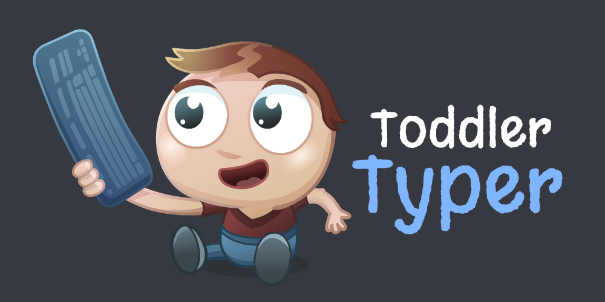

  

# Toddler Typer

A simple application for Microsoft Windows that will allow your toddler to play at pressing buttons on the keyboard in a cut-down word processor environment, without the risk of them messing up the rest of your computer.

Toddler Typer protects your computer in the following ways:
* Runs full-screen, so your toddler can't interact with your desktop or with other applications.
* Runs as a "top-most window", so even if your toddler manages to launch a different application, Toddler Typer will still stay on top.
* Doesn't have an "exit" button, so your toddler can't accidentally close the application. If you want to close it, just use the standard `ALT+F4` hotkey.
* If you have a multi-monitor system, Toddler Typer will launch simultaneously on every screen.

## Hotkeys

Toddler Typer doesn't have any buttons, to keep everything toddler-safe.

If you want to control Toddler Typer, the following hotkeys are available:

* `ALT + F4` to exit Toddler Typer.
* `CTRL + UP ARROW` to increase the font size.
* `CTRL + DOWN ARROW` to decrease the font size.

## Download

You can download Toddler Typer from [here](https://downloads.mking.net/ToddlerTyper.exe).

Because I don't want to spend hundreds of dollars for an [Authenticode certificate](https://docs.microsoft.com/en-us/windows-hardware/drivers/install/authenticode), you may see a pop-up from [Microsoft SmartScreen Filter](https://support.microsoft.com/en-us/microsoft-edge/what-is-smartscreen-and-how-can-it-help-protect-me-1c9a874a-6826-be5e-45b1-67fa445a74c8) when you download this file. It may warn you that the software is "unsafe", but all this actually means is that not enough people have downloaded the file yet for Microsoft to consider it to be "safe". I promise that there's no malware or viruses (and you can inspect the source code yourself to confirm this). I'll eventually upload Toddler Typer to the Microsoft Store to avoid all of these issues.

## System Requirements

* Windows 10, 64-bit

## Credits

* Programming by [Matthew King](https://github.com/MatthewKing)
* Logo by [Ben Hadfield](https://hadfield.design)
